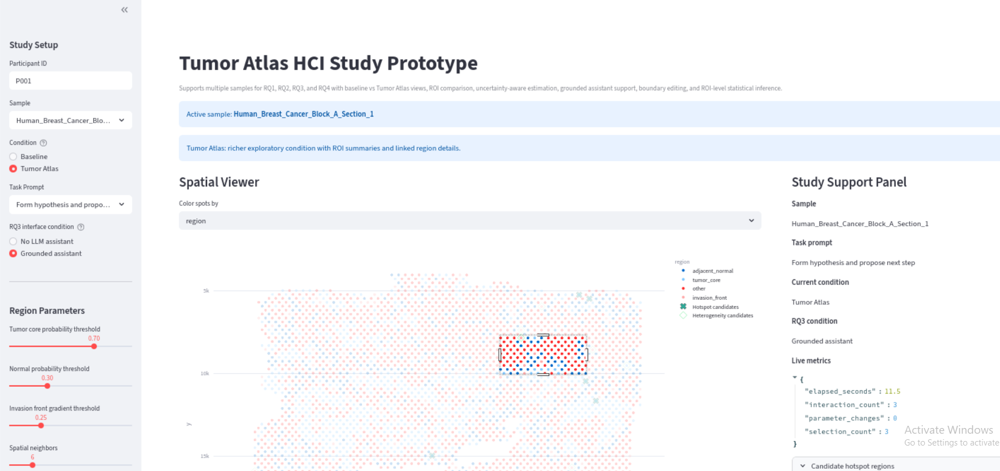

# Tumor Atlas HCI Study Prototype

An HCI-centered interactive prototype for exploring spatial tumor regions, comparing ROIs, reasoning under uncertainty, testing grounded assistant support, and examining human-in-the-loop boundary corrections.

---

## Abstract

This project presents an HCI-focused prototype for interactive analysis of spatial tumor data. The system is designed as a research instrument rather than a static visualization demo: it supports multiscale inspection, region-of-interest (ROI) selection, side-by-side ROI comparison, uncertainty-aware interpretation, grounded assistant-supported hypothesis generation, and boundary editing with before/after feedback. The interface is intended to help users identify tumor hotspots and heterogeneous regions, estimate tumor fraction and boundary class under uncertainty, articulate evidence-backed hypotheses, and understand the downstream effects of manual corrections. Across its iterations, the prototype was refined to better support interactive visualization design, uncertainty communication, explainable AI, and human-in-the-loop workflows.

**Application screenshot placeholder**



---

## What this prototype is for

This prototype supports four HCI-oriented research directions:

- **RQ1: Interactive hotspot and heterogeneity finding**  
  Compare whether richer interactive visualization supports faster and more confident region discovery than a simpler baseline.

- **RQ2: Uncertainty-aware interpretation**  
  Study how ROI cards and uncertainty overlays influence tumor fraction estimation and boundary classification.

- **RQ3: Grounded assistant support**  
  Evaluate whether a grounded assistant helps users produce more evidence-backed hypotheses and better next-step plans.

- **RQ4: Human-in-the-loop correction**  
  Examine how user edits to boundaries change downstream summaries and whether the system makes those consequences understandable.

---

## Key features

- **Multi-sample support**  
  Lets users switch between multiple tissue samples from the sidebar.

- **Baseline vs Tumor Atlas conditions**  
  Supports comparison between a simpler viewer and a richer interactive interface.

- **ROI selection**  
  Users can select regions with point, box, or lasso interactions.

- **ROI cards**  
  Summarize selected regions with tumor fraction, gradient, uncertainty, heterogeneity, and boundary cues.

- **Candidate hotspot ranking**  
  Surfaces likely hotspot regions based on weighted model-derived signals.

- **Candidate heterogeneity ranking**  
  Highlights likely mixed or transitional regions for further inspection.

- **Linked ROI details**  
  Shows selected-spot tables, distributions, and zoomed image patches.

- **Side-by-side ROI comparison**  
  Allows users to save multiple ROIs and compare them visually and quantitatively.

- **ROI statistical inference**  
  Compares marker/signature values between two ROIs using effect size, p-values, confidence intervals, and multiple-testing correction.

- **RQ2 uncertainty judgment workflow**  
  Lets users estimate tumor fraction and boundary class under different uncertainty-display conditions.

- **RQ3 grounded assistant workflow**  
  Supports evidence-based hypothesis writing and next-step planning with or without an assistant.

- **RQ4 boundary editing**  
  Lets users initialize a predicted boundary, add or remove spots, and inspect before/after consequences.

- **Study logging**  
  Records timing, confidence, selected ROIs, reasoning notes, and task-specific outcomes for later analysis.

---

## Repository structure

Example layout:

```text
.
├── rq1.v6.py
├── assistant.py
├── Preprocess_data/
│   ├── Sample_A/
│   │   ├── spots.parquet
│   │   └── tissue_hires_image.png
│   ├── Sample_B/
│   │   ├── spots.parquet
│   │   └── tissue_hires_image.png
│   └── Sample_C/
│       ├── spots.parquet
│       └── tissue_hires_image.png
└── docs/
    └── Interface.png